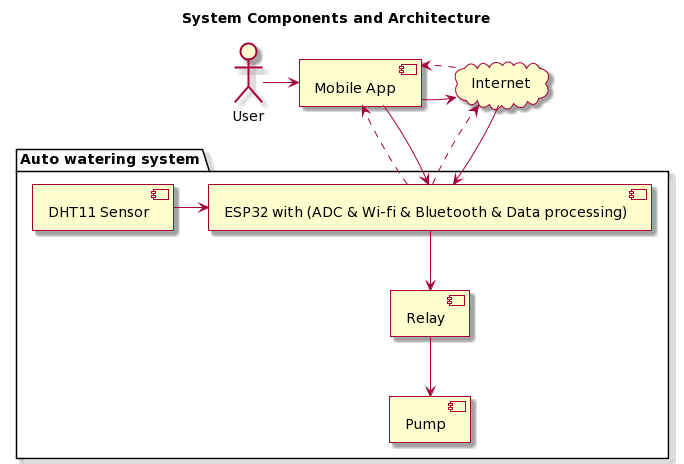
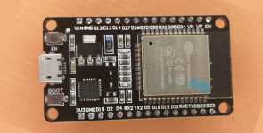
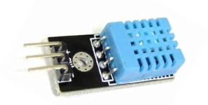
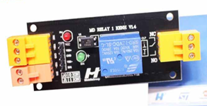
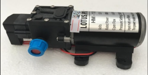
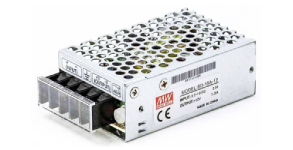
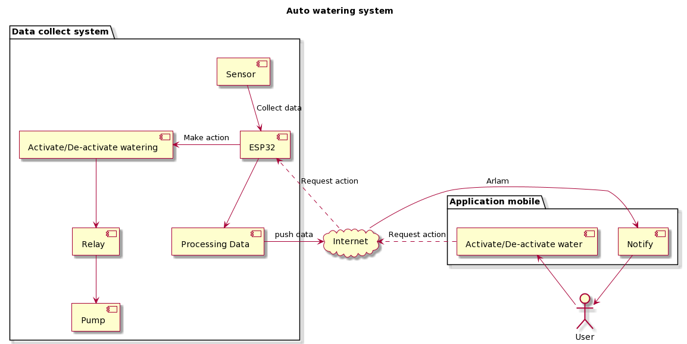
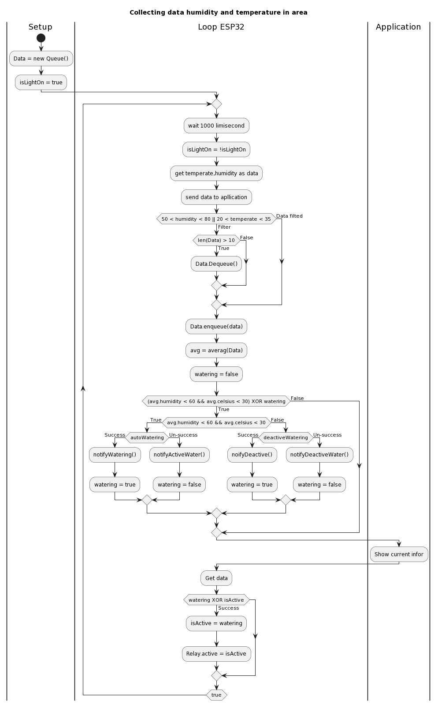

# Project Report

The auto watering system

---

## Student information

Student’s name: Nguyen Thi Ly Linh

Student’s code: M22.ICT.003

Email: linhntl.m22ict@usth.edu.vn

Last updated date: 30/04/2023 

---

## I. Introduction

- Nowadays, technological development follows no physical or invisible boundaries. Remote monitoring, data collection and processing systems are gaining more and more popularity in many different areas such as agriculture, medical or education.
    
    I have built an auto watering system for small gardens in houses (around 10 square meters). The system can meet the needs of families in big cities. 
    
    There are two main functions in the system. 
    
    1. It automatically waters plants based on the temperature and humidity level of the soil.
    2. Users can remote to turn on or off the device by a mobile application.
    
    Firstly, the model works by using temperature and humidity sensors to measure the temperature and humidity level of the soil. The microcontroller receives the data from the sensors and determines whether the soil is dry or wet. If the soil is dry, the microcontroller activates the water pump to water the plants. The water is stored in a reservoir, which is connected to the water pump.
    
    Secondly, in some cases, if the information is not enough to make a decision (sensor is broken), the system send a notification to users in the mobile application. They can remote to turn on or off the pump. 
    
- Effectively collecting and processing data from sensors used to detect humidity in the garden watering system is crucial for several reasons:
    1. Optimal watering: The watering system can be optimized to ensure that plants receive the appropriate amount of water by monitoring the soil's humidity levels. Overwatering or underwatering can harm plant growth and health. By collecting and analyzing data from humidity sensors, the watering system can be programmed to water the plants automatically only when required. This reduces water wastage and fosters healthy plant growth.
    2. Conservation of Resources: As water is a valuable resource, conserving it holds significant importance. By gathering and analyzing data from humidity sensors, the watering system can be tailored to water plants only when essential, minimizing water wastage and contributing to the conservation of this precious resource. This holds greater significance in regions where water is scarce, or during periods of drought.
    3. Health of Plants: The moisture levels in the soil have a direct effect on plant health. When the soil is excessively dry, plants can wilt or perish, while excessively moist soil can trigger root decay and other fungal infections. The watering system can be fine-tuned by collecting and examining data from humidity sensors to sustain ideal soil moisture levels. This helps to promote healthy plant growth and prevents plant diseases.
    4. Convenience: A garden watering system that operates automatically by utilizing humidity sensors offers a great deal of convenience to the gardener, as it eliminates the requirement of manual watering. The system can be programmed by collecting and analyzing data from the sensors to water the plants automatically as per their moisture requirements. This relieves the gardener of the time and effort involved in manual watering.

---

## II. System Components and Architecture

### 1. System Components

- Auto watering system
    - DHT11 sensor: a digital sensor that can measure temperature and humidity in a small area.
    - ESP32: a microcontroller that can connect to the internet and transmit data wirelessly.
    - Relay.
    - Pump.
- Internet (Firebase)
- Mobile application
    - Another remote function is using the mobile application to turn on or of devices directly.

### 2. System Architecture

*Figure 2.1: System Components and Architecture*

For detail: 

- The DHT11 sensor is connected to the ESP32 microcontroller through the digital input/output pins.
- The ESP32 is connected to the network and configured to periodically collect temperature and humidity data from the DHT11 sensor.
- The ESP32 push the information to firebase through the Internet.
- The ESP32 get the information periodically, analyze and make the decision to turn on or of the pump through the relay.
- The mobile application can turn on or of the pump directly by users.

---

## III. Implementation details

1. Components
    1. Microcontroller: ESP32 WROOM
        - The ESP32 WROOM microcontroller has many pros
            - It has two processor cores, enabling it to efficiently handle multiple tasks and deliver superior performance.
            - It comes with built-in Wi-Fi and Bluetooth modules, enabling it to easily connect to wireless networks and other devices.
            - Its low power consumption mode ensures extend battery life, making it ideal for applications that require long-term usage.
            - It boasts a large amount of memory, including both RAM and flash memory, enabling it to support more complex applications and data storage requirements.
            - It is an affordable option for hobbyists and developers when compared to other microcontrollers with similar capabilities.
        - Specification
            
            
            
            *Figure 3.1: ESP32 WROOM*
            
            | Bandwidth | 72 MHz |
            | --- | --- |
            | Data Rate | 150 Mbps |
            | Interface | Ethernet, I2C, I2S, SPI, UART |
            | Max Frequency | 2.484 GHz |
            | Max Operating Temperature | 85 °C |
            | Max Supply Voltage | 3.6 V |
            | Min Operating Temperature | -40 °C |
            | Min Supply Voltage | 3 V |
            | Nominal Supply Current | 500 mA |
            | Number of ADC Channels | 16 |
            | Number of GPIO | 32 |
    2. Sensor Humidity and temperatures: DHT11
        - DHT11 offers several advantages that make it a desirable choice
            - Low cost: The DHT11 sensor is an affordable option compared to other sensors with similar capabilities, making it an ideal choice for on a tight budget.
            - Easy to use: The sensor comes with a single data pin that makes it easy to connect to a microcontroller or development board. Additionally, it has a compact and simple design, which makes it easy to use and integrate into projects.
            - Decent accuracy: While the accuracy of the DHT11 sensor is not as high as some other sensors, it is still adequate for many applications. It can measure temperature with an accuracy of ±2°C and humidity with an accuracy of ±4%RH.
            - Wide voltage range: The DHT11 sensor operates on a wide voltage range of 3.3V to 5V, which means it can be used with a variety of microcontrollers and development boards.
            - Low power consumption: The sensor has a low power consumption, which makes it suitable for battery-powered applications.
        - Specification
            
            
            
            *Figure 3.2: DHT11*
            
            | Conditions | Conditions | Minimum | Typical | Maximum |
            | --- | --- | --- | --- | --- |
            | Humidity |  |  |  |  |
            | Measurement Range | 0℃ | 30%RH |  | 90%RH |
            |  | 25℃ | 20%RH |  | 90%RH |
            |  | 50℃ | 20%RH |  | 80%RH |
            | Accuracy | 25℃ |  | ±4%RH |  |
            | Response Time (Seconds) | 1/e(63%)25℃，
            1m/s Air | 6s | 10s | 15s |
            | Temperature |  |  |  |  |
            | Measurement Range |  | 0℃ |  | 50℃ |
            | Accuracy |  | ±1℃ |  | ±2℃ |
            | Response Time (Seconds) | 1/e(63%) | 6s |  | 30s |
    3. Module relay: Model SRD-12VDC-LS-C
        - Choosing the SRD-12VDC-SL-C relay module can provide a number of benefits for projects
            - Low power consumption: The relay module has a low power consumption, which means it can be used in battery-powered applications and reduces energy costs.
            - High switching capacity: The SRD-12VDC-SL-C relay module has a high switching capacity, which means it can handle large electrical loads with ease.
            - Easy to use: The module is easy to use and install, with clear labeling of input and output pins. It can be connected directly to a microcontroller or other control device.
            - Durability: The relay module is designed for long-term use and can withstand harsh environmental conditions, making it a reliable choice for industrial and commercial applications.
            - Low cost: The SRD-12VDC-SL-C relay module is relatively low cost compared to other types of relays, making it a cost-effective option for hobbyists and small-scale projects.
            - Easy to find: The relay module is widely available from electronics suppliers and can be easily purchased online.
        - Specification:
            
            
            
            *Figure 3.3: SRD-12VDC-LS-C*
            
            | Model Number | SRD-12VDC-SL-C |
            | --- | --- |
            | Coil Power  | 12V DC |
            | Pin Out | 5 Pin - Coil - COM - NC - NO |
            | Nominal Coil Power | 0.36w, 0.45W |
            | Contact Capacity | 10A 250VAC/10A 125VAC 10A 30VDC/10A 28VDC |
            | Insulation Resistance | 100MΩ.500VDC |
            | Operate Time | 15ms/10ms |
            | Terminal Type | PCB |
            | Contact Load | High Power |
            | Product name | 12V DC Electrical Relay SRD-05VDC-SL-C |
            | Contact Ratings | 1A,1C |
            | Contact Resistance | 100mΩ(at 10A 5VDC) |
            | Contact Material | Silver Alloy |
            | Size | Miniature |
    4. Pump: HM-1206
        - Compact and lightweight, the HM-1206 pump is easy to install and use in a variety of settings.:
            - Low noise: The HM-1206  pump operates with a low noise level of around 40dB, making it ideal for use in settings where noise levels need to be minimized.
            - High flow rate: The pump can deliver a maximum flow rate of up to 12 liters per minute, which makes it suitable for a wide range of applications that require fast liquid transfer.
            - High reliability: The HM-1206 pump is made from high-quality materials and designed to withstand continuous use without failure, ensuring long-term reliability.
            - Easy to install: The pump is compact and lightweight, which makes it easy to install and use in a variety of settings.
            - Energy efficient: The HM-1206 pump is designed to operate on low power, making it an energy-efficient option that can help to reduce electricity costs.
            - Low maintenance: The pump is designed for low maintenance and can be easily disassembled for cleaning and servicing.
        - Specification
            
            
            
            *Figure 3.4: HM-1206*
            
            | Usage voltage | 12v |
            | --- | --- |
            | Usage voltage | 80W |
            | Traffic | 6 l/min |
            | Pressure | 145PSI (10bar). |
            | Weight | 1,2kg |
    5. Electricity supply: Meanwell SD-15A-12
        - Meanwell SD-15A-12 is a reliable and high-quality power supply that is commonly used in various electronic applications. It has several advantages that make it a popular choice
            - The power supply has a compact and lightweight design, making it easy to install and use in a variety of applications.
            - It has a high operating efficiency of up to 87%, which means that it converts electrical power to usable output power with minimal energy loss.
            - The power supply has a wide operating temperature range of -30°C to +70°C, making it suitable for use in harsh environments.
            - It is built with high-quality materials, ensuring reliable and long-lasting performance.
            - The power supply has built-in short circuit, overload, and overvoltage protection, which ensures safe and reliable operation.
        - Specification
            
            
            
            *Figure 3.5: SD-15A-12*
            
            | Input | A: 9.2~18VDC (12VDC) |
            | --- | --- |
            | Performance | 72% |
            | Output | 12V, 1.25A, 15W |
            | Impulse noise | 120mVp-p |
            | Size | 78*51*28 (L*W*H) |
            | Weight | 0.18kg/pc |
2. Model: Data processing techniques
    
    
    
    *Figure 3.6: Relationship and communication in the system* 
    
    When it comes to watering plants, research findings recommend doing so when the temperature is below 30 degrees Celsius and the humidity level is below 60%. Therefore, it is crucial to constantly monitor the temperature and humidity levels in the plant's environment to ensure that they receive the appropriate amount of water. Effective data processing techniques are necessary to achieve this goal and ensure the accuracy and reliability of humidity and temperature readings.
    
    One technique that can be used is setting thresholds for both humidity and temperature and filtering out any readings that fall outside of the desired range. This can help to refine data by removing irrelevant values and providing valuable insights to aid in decision-making. By discarding any readings that fall outside of the desired range, such as a temperature range of 20 to 35 degrees Celsius or a humidity range of 50% to 80%.
    
    To ensure that the temperature readings are accurate, it is important to take several measurements over a period of time and average the results. The number of readings to average can vary depending on the situation, but a common approach is to average the last 5 to 10 readings taken over a certain period of time, such as 5 to 10 minutes. This technique helps to reduce the effects of fluctuations in temperature and provides a more accurate representation of the environment's overall temperature.
    
    
    
    *Figure 3.7: Data processing and decision-making in detail*
    
    In order to ensure the proper growth and health of plants, it is important to maintain appropriate levels of temperature and humidity in their environment. Monitoring these levels can be done using sensors that provide continuous readings, which can then be processed and analyzed to make informed decisions about watering schedules. However, it is possible for errors to occur with these sensors or with the communication of data to the central system.
    
    To address this, a system of notifications has been implemented for users of the plant monitoring application. If the Celsius data falls outside the range of 0℃ to 50℃ or remains constant for an entire day, the user will receive a notification informing them of the error. Similarly, if the humidity data falls outside the range of 20%RH to 90%RH or remains constant for an entire day, a notification will be sent to the user.
    
    Additionally, if Firebase, the central system for data collection and analysis, does not receive any new data about humidity and temperature, the user will be notified of this as well. This could indicate an issue with the sensors or with the communication of data to the central system, and prompt the user to investigate and resolve the issue.
    
    Finally, in the event that the relay is unable to activate to open the water, the user will also receive a notification. This could be due to a variety of factors, such as a malfunctioning relay or a disruption in power or communication. By receiving these notifications, users can stay informed and take action to address any issues that may arise, ensuring that their plants remain healthy and properly watered.
    
3. Communication protocols
    
    Connecting an ESP and a mobile application via HTTP over Wi-Fi provides a reliable and efficient means of communication. The ESP serves as a web server that can respond to HTTP requests sent by the mobile application. By using HTTP, the mobile application can easily send commands or receive data from the ESP. The Wi-Fi connection provides a stable and fast communication channel between the two devices, ensuring that data is transmitted quickly and accurately. This type of connection is commonly used in IoT applications, where the ESP acts as a control center for various sensors and devices, and the mobile application provides an interface for users to monitor and control these devices remotely. Overall, using HTTP over Wi-Fi offers a practical and effective solution for connecting an ESP and a mobile application in an IoT environment.
    

---

## IV. Testing and Validation

Simulation code on the github: 

- Get the temperature and humidity information from DTH11 to ESP32
- Use the information to turn on or off the pump automatically
- Display result

---

## V. Conclusion

The system has many advantages that can meet the needs and requirements of families in big cities. Besides, there are some features (limitations) I think we can develop and improve them in the near future. 

- Advantages
    - The system's ability to optimize watering and conserve resources makes it an environmentally-friendly solution for gardeners and farmers alike.
    - The system's use of low-cost and widely available components such as the DHT11 sensor and ESP32 microcontroller makes it an affordable option for hobbyists and small-scale applications.
    - The scalability of the system may be limited by the use of a single sensor and the processing power of the microcontroller, which may need to be upgraded for larger-scale implementations.
    - Incorporation remote access and control capabilities allows the user to monitor and adjust the system from anywhere.
- Scalability
    
    The scalability of the system would depend on the specific implementation and the needs of the real-world application. However, one potential limitation of the system's scalability is the use of a single sensor to collect data in a limited area. If the real-world application requires data collection over a larger area or more precise measurements, additional sensors may need to be added or a different sensor with higher accuracy may need to be used. Additionally, the system's scalability may be limited by the processing power of the microcontroller, which may struggle to handle larger amounts of data or more complex decision-making algorithms. Therefore, it may be necessary to upgrade the microcontroller or use a more powerful processing unit to accommodate a larger scale implementation.
    
- Limitations
    - The system can be improved by incorporating more sensors to collect additional data such as light levels and soil pH, which can provide further insight into plant health and growth.
    - Additionally, the system can be further developed to include machine learning algorithms to analyze the data and make more informed decisions about watering schedules and plant care.
